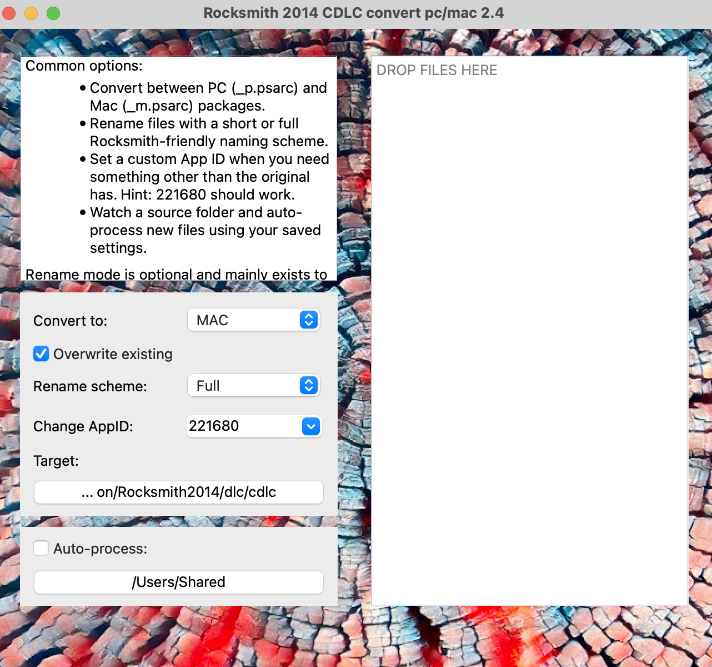

auto-processing feature, you can set the app to check desired folder at launch and do the processing automatically,
# Rocksmith 2014 CDLC Convert PC / Mac

Simple GUI app for converting or renaming Rocksmith 2014 `.psarc` files between PC and Mac formats.

The app is based on 0x0L's pyrocksmith: https://github.com/0x0L/rocksmith



## What it does

- Drag and drop one or more `.psarc` files into the app.
- Convert between PC (`_p.psarc`) and Mac (`_m.psarc`) packages.
- Rename files with shorter Rocksmith-friendly names.
- Optionally set a custom app ID during conversion.
- Watch a source folder and process new files automatically.

Original files are never modified. The app always writes a new file to the target folder.

## Download and install

Download the latest macOS release here:
https://github.com/glebb/rocksmithconvert/releases

1. Download the zip package.
2. Unzip it if your browser does not do that automatically.
3. Move the app anywhere you want, for example to Applications.
4. On first launch, allow the app in macOS System Settings or System Preferences if Gatekeeper blocks it.

## Usage

Drop files onto the running app to process them. You can also drop files onto the app icon to launch and process them directly.

Common options:

- Convert only
- Rename only
- Convert and rename
- Overwrite existing target files
- Auto-process new files from a source folder

If the target file already exists and overwrite is disabled, the file is skipped.

Example:

Input:
`/Users/john/Downloads/Really_Long_Artist_Name-ThisIsJustATribute_p.psarc`

Possible output:
`/Users/john/Library/Application Support/Steam/steamapps/common/Rocksmith2014/dlc/ReallyLong-ThisIsJust_m.psarc`

The exact result depends on your selected target folder, platform, rename mode, and app ID settings.

### Notes

- Auto-processing remembers your settings and can watch a folder for new `.psarc` files.
- Mixed PC and Mac source files are handled based on the target platform you selected.
- Rename mode exists mainly to avoid Rocksmith issues with long or unusual CDLC filenames.

## Development

The current app is the PyQt-based 2.x rewrite. It keeps pyrocksmith for PSARC handling and adds a desktop UI, saved settings, and threaded processing.

### Requirements

- Python 3.12 recommended for development and packaging
- Use a `universal2` Python 3.12 build from python.org for macOS builds that need to target both Apple Silicon and Intel
- Python 3.14 may work for local development, but it is not the recommended packaging baseline for this project
- `requirements.txt` for general development and PyQt5-based macOS builds
- `requirements-m1.txt` for PyQt6-based macOS builds, including Apple Silicon and Intel builds created from Apple Silicon via Rosetta
- `requirements-dev.txt` for tests and formatting tools

### Setup

```bash
pip install -r requirements-dev.txt
pip install -r requirements.txt
pip install -e src/.
```

For PyQt6-based macOS development or packaging, install `requirements-m1.txt` instead of `requirements.txt`:

```bash
pip install -r requirements-dev.txt
pip install -r requirements-m1.txt
pip install -e src/.
```

If you are setting up from scratch on macOS, use Python 3.12 first unless you are deliberately testing newer interpreter support.

For older macOS targets such as 10.15 Catalina, prefer the PyQt5 path from `requirements.txt`. Current PyQt5 wheels are packaged for older Intel macOS deployment targets than current PyQt6 wheels.

### Run tests

```bash
pytest
```

### Run the app locally

```bash
python -m rocksmithconvert.convert_gui
```

### UI workflow

`mainwindow.ui` is the source of truth for the main window.

Generate Python code with `pyuic5` or `pyuic6`, for example:

```bash
pyuic6 -x src/rocksmithconvert/mainwindow.ui -o src/rocksmithconvert/mainwindow.py
```

After regenerating, replace the generated Qt imports with:

```python
from rocksmithconvert.qt_wrapper import QtCore, QtGui, QtWidgets
```

This keeps the project compatible with both PyQt5 and PyQt6.

For local compatibility checks, you can force a specific binding:

```bash
ROCKSMITHCONVERT_QT_API=pyqt5 python -m rocksmithconvert.convert_gui
ROCKSMITHCONVERT_QT_API=pyqt6 python -m rocksmithconvert.convert_gui
```

### Build a standalone app

```bash
pyinstaller --clean RSConvert_GUI.spec
```

To package a specific Qt binding, set `ROCKSMITHCONVERT_QT_API` explicitly:

```bash
ROCKSMITHCONVERT_QT_API=pyqt5 pyinstaller --clean RSConvert_GUI.spec
ROCKSMITHCONVERT_QT_API=pyqt6 pyinstaller --clean RSConvert_GUI.spec
```

The spec now carries that binding choice into the bundled app with a runtime hook, so startup does not spend time probing the other Qt binding at launch. If only one of `PyQt5` or `PyQt6` is installed in the build environment, the spec will also auto-select it.

The spec also enables Python bytecode optimization, bundles only the assets that are currently used by the app UI, and now builds a true collected macOS `.app` bundle instead of packing everything into one large executable. That collected layout is intentionally chosen because packed macOS app bundles tend to launch more slowly under Gatekeeper and PyInstaller bootstrapping.

To profile launch time from inside the app, set `ROCKSMITHCONVERT_STARTUP_TIMING=1` before starting it. The app will print checkpoints such as `QApplication created`, `main window shown`, and `deferred startup complete` to stderr, which makes it easier to separate PyInstaller launch overhead from Python and Qt initialization time.

Examples:

```bash
ROCKSMITHCONVERT_STARTUP_TIMING=1 python -m rocksmithconvert.convert_gui
ROCKSMITHCONVERT_STARTUP_TIMING=1 dist/RSConvert_GUI.app/Contents/MacOS/RSConvert_GUI
```

On Windows:

```bash
pyinstaller --name RSConvert_GUI --windowed --onefile src/rocksmithconvert/convert_gui.py --clean --icon=docs/rsconvert.ico --add-binary src/rocksmithconvert/assets;assets
```

### Build an Intel macOS app on Apple Silicon

You can build an `x86_64` macOS app on Apple Silicon by running the build under Rosetta with an `x86_64`-capable Python installation.

If you need older macOS compatibility such as 10.15 Catalina, prefer the PyQt5 build path. If you want the newer PyQt6 stack, treat it as a newer-macOS-only target unless you re-verify the bundled binary deployment targets.

Recommended setup:

- Install Rosetta 2.
- Use a `universal2` Python from python.org rather than an `arm64`-only Python build.
- Prefer Python 3.12 specifically and make sure `python3.12` resolves to that `universal2` install inside the Rosetta shell.
- Create the virtual environment from a Rosetta shell so Python, pip, and PyInstaller all run as `x86_64`.

PyQt5-oriented workflow for older macOS targets:

```bash
softwareupdate --install-rosetta --agree-to-license
arch -x86_64 zsh
python3.12 -m venv .venv-intel
source .venv-intel/bin/activate
python -m pip install --upgrade pip setuptools wheel
pip install -r requirements-dev.txt
pip install -r requirements.txt
pip install -e src/.
ROCKSMITHCONVERT_QT_API=pyqt5 python -m rocksmithconvert.convert_gui
ROCKSMITHCONVERT_STARTUP_TIMING=1 ROCKSMITHCONVERT_QT_API=pyqt5 PYINSTALLER_TARGET_ARCH=x86_64 pyinstaller --clean RSConvert_GUI.spec
file dist/RSConvert_GUI.app/Contents/MacOS/RSConvert_GUI
du -sh dist/RSConvert_GUI.app
```

PyQt6-oriented workflow for newer macOS targets:

```bash
softwareupdate --install-rosetta --agree-to-license
arch -x86_64 zsh
python3.12 -m venv .venv-intel
source .venv-intel/bin/activate
python -m pip install --upgrade pip setuptools wheel
pip install -r requirements-dev.txt
pip install -r requirements-m1.txt
pip install -e src/.
ROCKSMITHCONVERT_QT_API=pyqt6 python -m rocksmithconvert.convert_gui
ROCKSMITHCONVERT_QT_API=pyqt6 PYINSTALLER_TARGET_ARCH=x86_64 pyinstaller --clean RSConvert_GUI.spec
file dist/RSConvert_GUI.app/Contents/MacOS/RSConvert_GUI
du -sh dist/RSConvert_GUI.app
```

The final `file` command should report `x86_64`. If it reports `arm64`, the virtual environment was created from the wrong interpreter.

For a native Apple Silicon build, run the same command without Rosetta and set `PYINSTALLER_TARGET_ARCH=arm64` if you want the target to be explicit.

If you want to compare package size across build variants, use `du -sh dist/RSConvert_GUI.app` after each build. For older macOS compatibility, compare PyQt5 builds first because the PyQt5 path is currently the recommended compatibility release path.

## Project layout

- `src/rocksmithconvert/controllers.py`: main window controller and signal wiring
- `src/rocksmithconvert/services.py`: conversion, worker threads, and file processing
- `src/rocksmithconvert/models.py`: process model passed into workers
- `src/rocksmithconvert/settings.py`: persistent UI settings
- `tests/`: controller and GUI behavior tests

