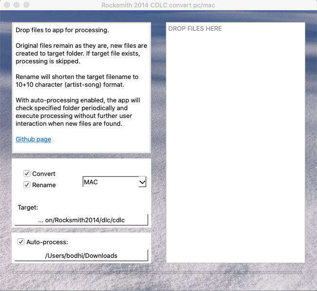

# Rocksmith 2014 CDLC convert PC / Mac #
Simple standalone OSX app to convert/rename Rocksmith 2014 .psarc files between PC and MAC.

Based on 0x0L's pyrocksmith (https://github.com/0x0L/rocksmith)

## Download & install ##
Download latest readymade package for OSX 10.13 and newer: https://github.com/glebb/rocksmithconvert/releases

* Download the zip package
* Unzip by double clicking the file (if needed, e.g. Safari does this automatically)
* No installation needed, you can move the app to Applications folder if you like
* Start the app -> osx security kicks in (the first time you run it):
* Allow the app to run by checking osx System Preferences / Security & Privacy / General -> Allow

## Usage ##
Just drag & drop files you want to convert to the app (supports mass conversions).
Additionally, you can choose to use short filenames or just rename(copy) the files without conversion.

If target file already exists, operation is skipped. Original files are not modified, the app always
creates new files as a result of conversion/rename.

Example: your CDLC is /Users/john/Downloads/Really_Long_Artist_Name-ThisIsJustATribute_p.psarc
Dropping the file to the app and processing with conversion and rename options enabled, 
following file is produced: /Users/john/Library/Application Support/Steam/steamapps/common/Rocksmith2014/dlc/ReallyLong-ThisIsJust_m.psarc
(target folder of course depends on your selection).

The next time you run the app, settings are as you set them before. With remembering settings combined with
auto-processing feature, you can set the app to check desired folder at launch and do the processing automatically,
without any user interaction. You can use it to scan Downloads folder and automatically convert
files dlc/cdlc folder. It doesn't matter what files are in the source folder, only files that are
not in target already will be processed.

If you don't use autoprocessing, you can just drop the files on the app while it's running to invoke processing.
Additionally you can drop files directly on the app icon (e.g. on Dock) while holding down cmd (Option) before you start the drag.
This will open the app and automatically process the files.

If source folder contains both pc (_p.psarc) and mac (_m.psarc) files, the processor picks all of them
and either copies or converts the files based on platform selection to the target folder.

NOTE! Option for renaming is to avoid problems loading CDLC within Rocksmith. 
This is achieved by removing all unecessary characters and also splitting Artist and Song name
if needed. Using rename scheme is optional.

## Versions ##

1.1 Was the first public release. It is considerably different from the current version. See details from the
[1.1 readme](https://github.com/glebb/rocksmithconvert/blob/v1.1/README.md). The main difference is that 1.1
user interface was build on platypus and applescript. Most of it was implemented as pure bash script.
It did (still does) its job, but considering the limitations, it was not feasible to develop it much further as
adding new features became increasingly awkward.

2.x Is the current branch, based on PyQt5. It still uses pyrocksmith as it's core for the psarc file handling,
but otherwise it's a complete rewrite. New features include e.g. permanent settings and using threads for
processing, making it much faster. In theory, it should also work cross platform (it hasn't been developed or tested
with Windows though!)

## Development & building from source ##
The basic idea is to use pyrocksmith to parse the files and
bundle everything to a nice and clean standalone osx app without additional
dependencies. Batteries included. This is achieved
by using pyinstaller to create a single executable from PyQt app.
### Requirements ###
* Python 3.6+:
   * `pip install -r requirements.txt`:
      * PyQt6
      * pyinstaller (https://pypi.org/project/pyinstaller/)
      * git+https://github.com/0x0L/rocksmith.git

### Testing ###
Install dependencies: `pip install -r requirements-dev.txt`
Install as a local package: `pip install -e src/.`
Run tests: `py.test`

### UI ###
Qt Creator is used to handle the master .ui and resource files and those should always be up to date (no manual changes to generated python files). 
To convert "qt" files to python source, use pyuic (and pyrcc for resources) (e.g. `pyuic6 -x mainwindow.ui -o mainwindow.py`)

### Making convert_gui.py as standalone executable ###
Running `pyinstaller --name 'RSConvert_GUI' --windowed --onefile src/rocksmithconvert/convert_gui.py --clean --icon=docs/rsconvert.icns --add-binary src/rocksmithconvert/assets:assets` creates an executable under .dist/.

### Misc ###
env PYTHON_CONFIGURE_OPTS="--enable-framework" pyenv install 3.9.9

